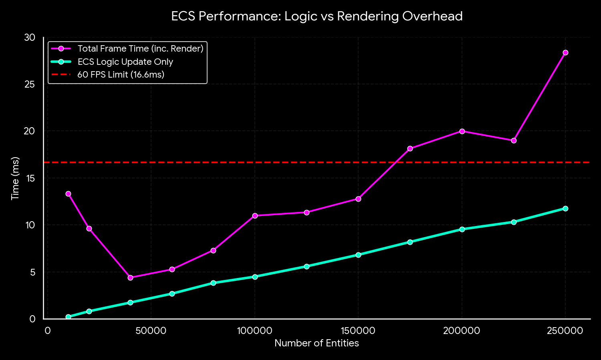
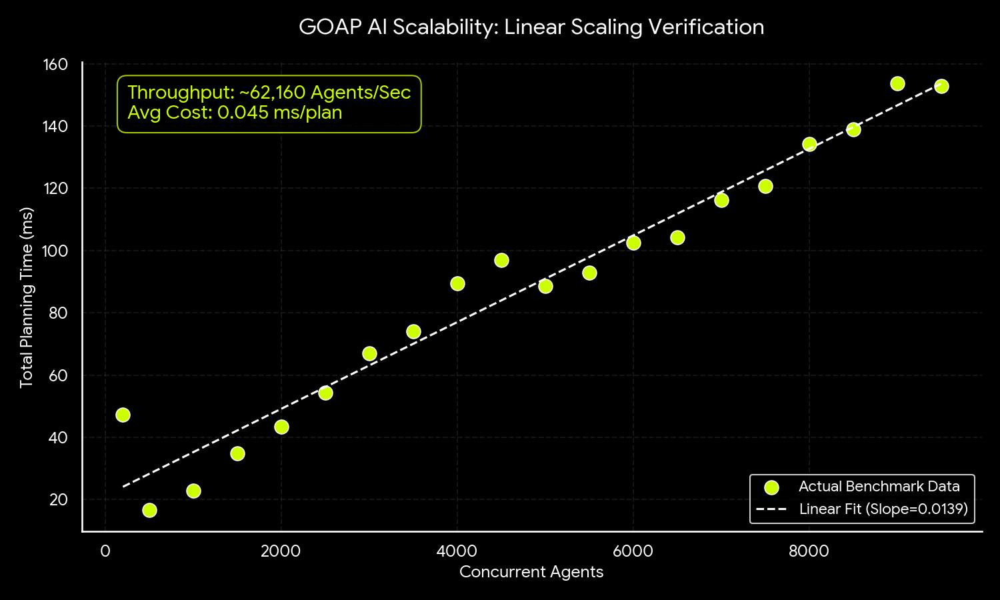
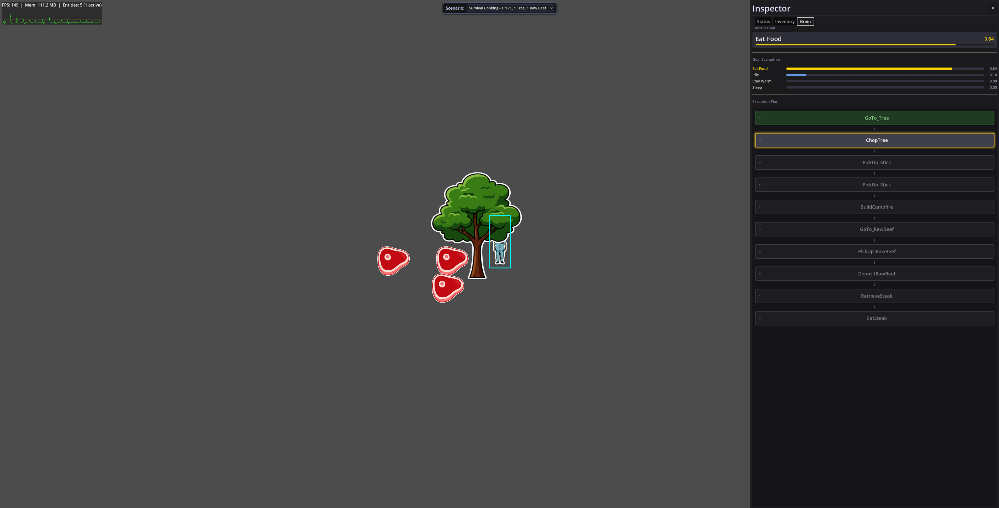

# Godot GOAP & ECS Demo

This project is a high-performance architectural demonstration of Goal-Oriented Action Planning (GOAP) integrated with a custom Entity Component System (ECS) in Godot 4 (C#). It is designed to validate how complex AI systems and massive entity counts can scale in a real-time environment.

## What's Inside?

*   **High-Throughput GOAP Planner:** An advanced A* planner that can generate over 60,000 action plans per second, running in parallel across available CPU cores.
*   **Custom ECS Architecture:** A lightweight, data-oriented ECS implementation capable of updating 250,000+ simple entities and 50,000+ complex entities while keeping frame times manageable.
*   **Spatial Partitioning:** A custom QuadTree implementation optimized for fast spatial queries and resource lookups.
*   **Benchmarking Tools:** Built-in harnesses to stress-test the system and visualize performance metrics (press `B` in-game).

## Performance

We built this system to run fast. Below are the results from our latest benchmarking run, showing how the architecture handles load.

### Hardware Context
These benchmarks were recorded on the following machine:
*   **CPU:** AMD Ryzen 9 7950X (32 Threads @ 5.88 GHz)
*   **GPU:** NVIDIA GeForce RTX 5070 Ti
*   **RAM:** 94 GB
*   **OS:** CachyOS (Linux Kernel 6.17)

### ECS Scalability
The ECS logic update loop is decoupled from rendering, allowing the simulation to remain stable even as entity counts push into the hundreds of thousands.

### GOAP AI Throughput
The AI planner scales linearly with the number of concurrent agents. In our tests, the system achieved a throughput of approximately **62,000 agents per second**, with an average planning cost of just **0.045ms** per plan.

## Getting Started

1.  Open the project in **Godot 4.5** (C# edition).
2.  Build the solution to restore NuGet packages.
3.  Run `scenes/main.tscn`.
4.  Press `B` at any time to run the benchmark suite yourself.

## Where to find Benchmark Results
If you run the benchmarks yourself, you'll see in the root of the project (likely called GODOT-GOAP-DEMO) there will be a file called torvie_benchmark_(date)_(time).csv which will contain all the data retrieved durring the benchmark

## Visual Examples

### Simple sceanrio with 1 tree, 3 raw food items, and a single intelligent agent.

### Complex scenario with over 500 agents. Agents have chopped down trees and used the sticks to create campfires and beds. 
